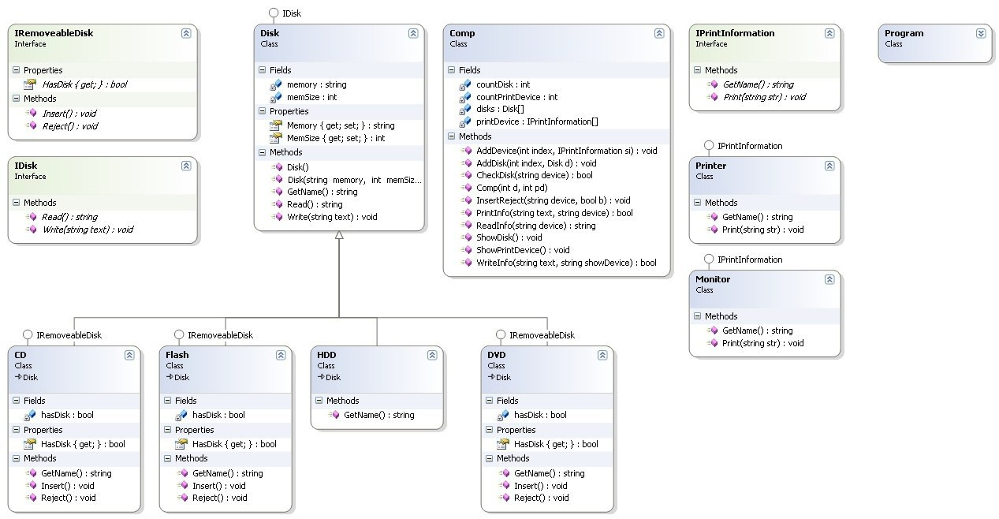

Завдання 1:
Розробити структуру класів відповідно до UML діаграми (див. рис). Описати 
необхідні класи та інтерфейси. Реалізувати залежності між ними (імплементація, 
наслідування). Алгоритми методів можна залишити на рівні імітації виконання 
роботи.
Протестувати працездатність, для цього потрібно створити екземпляр(и) класу 
Comp та наповнити його властивості відповідними даними. Протестувати написані 
методи, передавши всі необхідні для них параметри.

